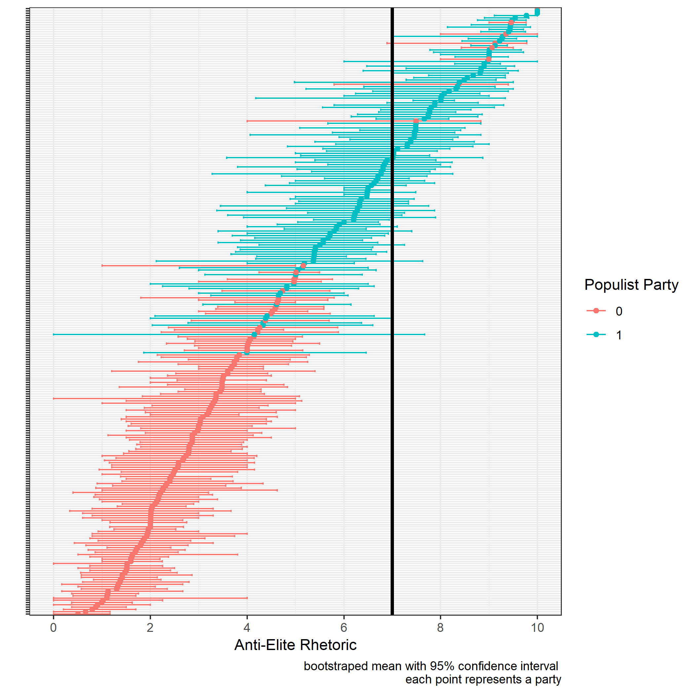
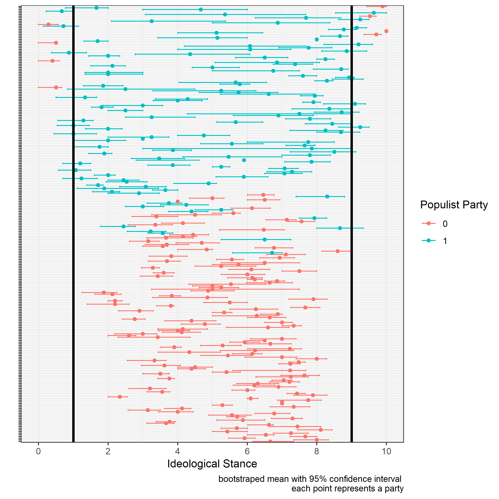
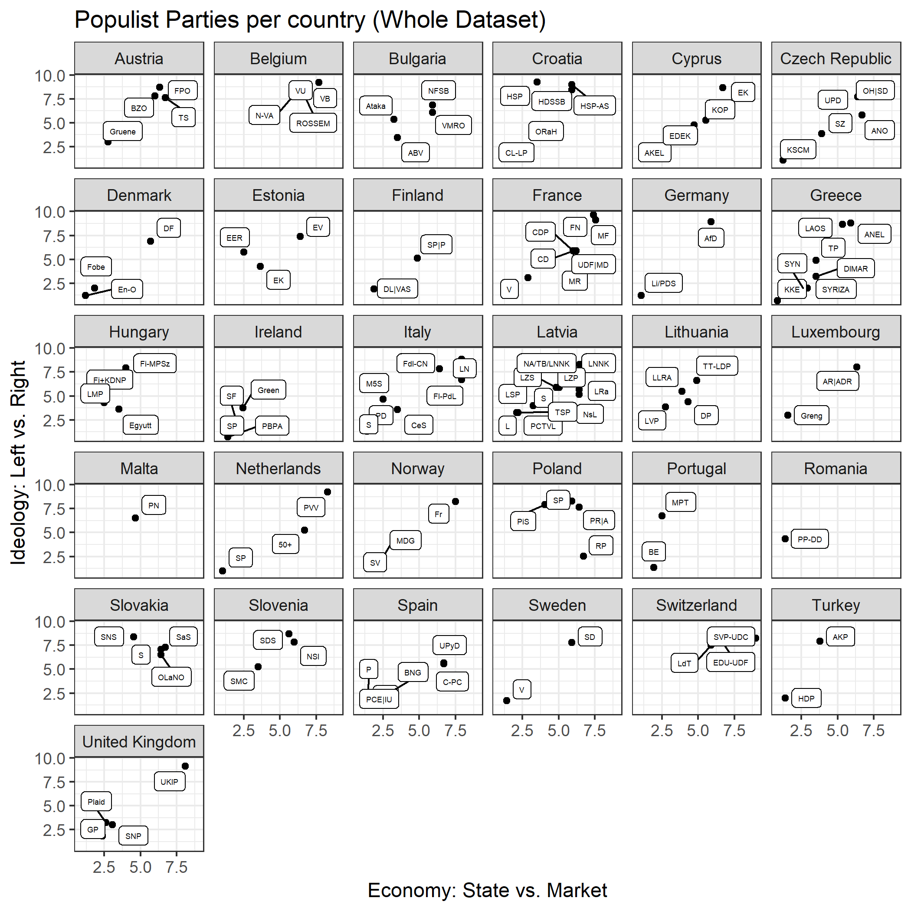
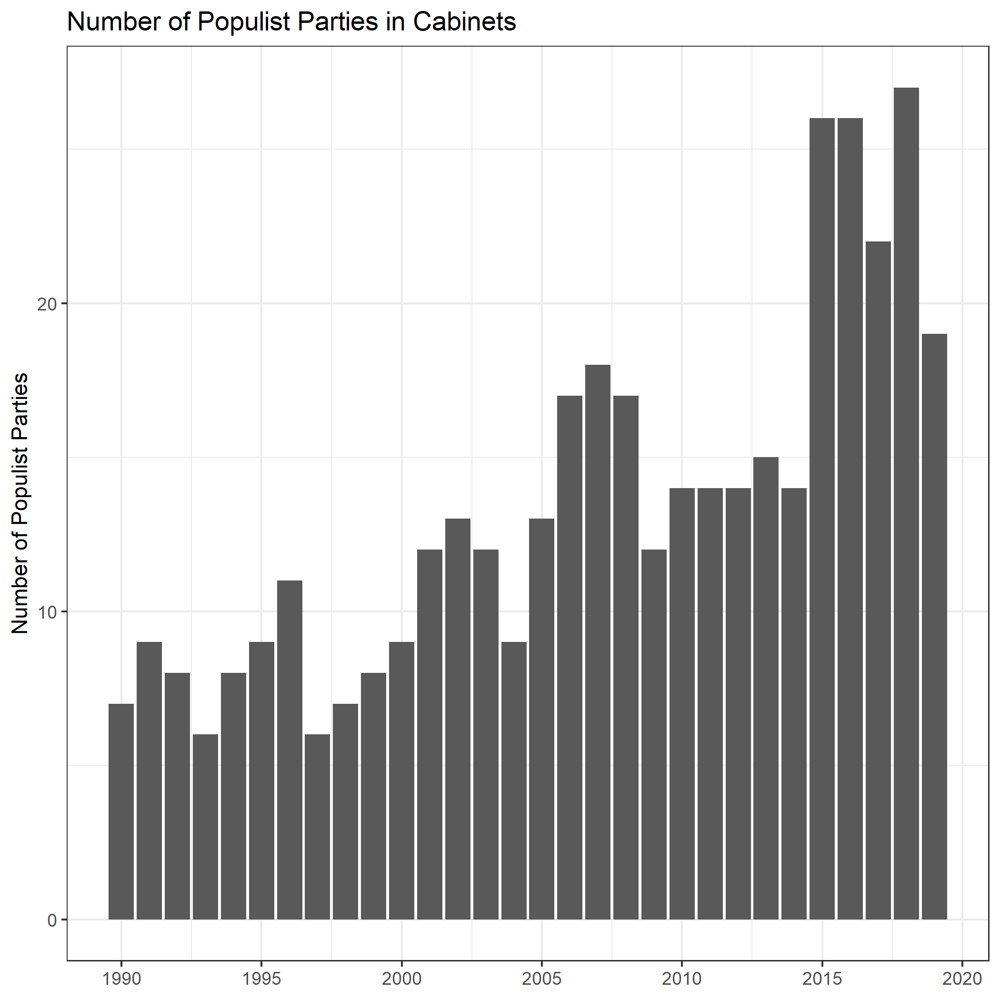

```{r setup, include=FALSE}
knitr::opts_chunk$set(echo = FALSE, fig.align = "center")

```

## Consequences of Populist Parties for the Quality of Democracy?

- On the one hand: Broadening of the electorate through inclusion of the "left behind" 
- On the other hand: Declining Quality of Democracy due to Authoritarian Populist Rule
- *Any References?*

## What is a "Populist" Party? How can we measure it?

- three defining elements:
  1. anti-elite rhetoric
  2. thin ideology
  3. anti-pluralistic
 
- Indicators of Chapel Hill Expert Survey 2014:
  1. "salience of anti-establishment and anti-elite rhetoric" (0: not important; 10: important)
  2. "position of the party in2014in terms of its overall ideological stance" (0: left; 10: right)

## Distribution of these two variables

```{r Density Plot, out.width='75%', out.height='60%', message=FALSE, warning=FALSE}


```

- anti-elite-salience is right-skewed (more parties without anti-elite rhetoric)
- ideological stance is slightly left-skewed (slightly more right-wing parties)

## Classification I

```{r antielite Plot, out.width='90%', out.height='70%', message=FALSE, warning=FALSE}



```

- vertical line represents threshold
- *change 95% confidence intervals? change threshold placement?*

## Classification II


```{r lrgen Plot, out.width='90%', out.height='70%', message=FALSE, warning=FALSE}



```

- vertical lines represents threshold: extremist left parties; extremist right parties
- *change 95% confidence intervals? change thresholds placement?*

## Populist Parties per Country

```{r Parties per Country Plot, out.width='100%', message=FALSE, warning=FALSE}



```

- there are a lot of populist parties...

## Populist Parties per Country: Vote Share

```{r Parties per Country Vote, out.width='100%', message=FALSE, warning=FALSE}

knitr::include_graphics('PNG/party_per_country_vote.png')

```

- ... but most of them are not relevant


## Populist Parties: Votes and Seats

```{r Parties Since 1990, fig.show='hold', out.width='50%', message=FALSE, warning=FALSE}

knitr::include_graphics(c('PNG/party_vote.png', 'PNG/party_seat.png'))

```

- number of seats and votes for populist parties across european countries is increasing since 1990


## Populist Parties: Cabinets

```{r Cabinet Parties Since 1990, out.width='50%', message=FALSE, warning=FALSE}



```

- populists caputre more cabinet positions (with a spike in 2015)

## Populist Parties and Quality of Democracy

```{r DQ, out.width='90%', out.height='70%', message=FALSE, warning=FALSE}

knitr::include_graphics('PNG/Total_index_pop.png.png')

```

- we examine a mostly slight regression of DQ for some countries since 2010 (Turkey; Hungary; Poland; but also for Croatia, Germany, Romania, Sweden, Spain, UK)

## TSCS: Basics

- Violations of the OLS assumptions by combining cross-sectional and time-series data:
  - Unit Root
  - Serial Correlation 
  - Unit Heterogeneity
  - Panel Heteroskedasticity and Contemporaneous Errors


## TSCS Regression: Total Value Index

```{r TSCS Total, echo=FALSE, results='asis'}

model_table = coeftest(total_value_m_w, vcov=vcovBK)
stargazer(model_table, header=FALSE, type='latex', 
          font.size="scriptsize",
          single.row = T,
          digits=3,
          style="apsr",
          title="Table of TSCS Results (within-Model; PCSEs)",
          dep.var.labels = "Total Value Index (Context)",
          report = 'vc*sp' )


```

## TSCS Regression: Freedom Value Index

```{r TSCS Freedom, echo=FALSE, results='asis'}

model_table = coeftest(freedom_value_m_w, vcov=vcovBK)
stargazer(model_table, header=FALSE, type='latex', 
          font.size="scriptsize",
          single.row = T,
          digits=3,
          style="apsr",
          title="Table of TSCS Results (within-Model; PCSEs)",
          dep.var.labels = "Freedom Value Index (Context)",
          report = 'vc*sp' )


```

## TSCS Regression: Equality Value Index

```{r TSCS Equality, echo=FALSE, results='asis'}

model_table = coeftest(equality_value_m_w, vcov=vcovBK)
stargazer(model_table, header=FALSE, type='latex', 
          font.size="scriptsize",
          single.row = T,
          digits=3,
          style="apsr",
          title="Table of TSCS Results (within-Model; PCSEs)",
          dep.var.labels = "Equality Value Index (Context)",
          report = 'vc*sp' )


```

## TSCS Regression: Control Value Index

```{r TSCS Control, echo=FALSE, results='asis'}

model_table = coeftest(control_value_m_w, vcov=vcovBK)
stargazer(model_table, header=FALSE, type='latex', 
          font.size="scriptsize",
          single.row = T,
          digits=3,
          style="apsr",
          title="Table of TSCS Results (within-Model; PCSEs)",
          dep.var.labels = "Control Value Index (Context)",
          report = 'vc*sp' )


```


## References


